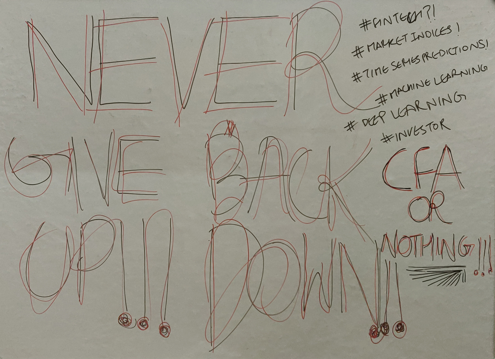

*Hello, this is me!*

I currently am a Specialist Software Engineer at Societe Generale here in Bengaluru and have cleared the CFA Level 1 examination. I aspire to work in the domain of Data Science. I also am exploring Quantitative Finance as a hobby. Also, I used to be a professional theatre artist - did a few gigs with TVF Timeliners, NSD(National School of Drama), Crea-Shakthi Theatre group and VIT(my alma mater) Dramatics Club.

Have drained myself completely during the COVID Lockdown here in India. Building a personal website had long been my dream, and after all these years of excuses; the lockdown had given me just the time for it! So I made this site because I have wanted to blog since forever, share my thoughts & poems, share my projects for being presentable in the Data Science domain for which I am crushing hard to penetrate and above all - because I wanted one!

Here is what has been happening on my board + life for past few months:

*My current state + motto + mantra + ambitions*

And this is my timeline - some of the most important milestones in recent years which have contributed in shaping my philosophy on life and professional career:

*My important milestones so far in life*

Here are direct links for _some_ of my projects:

| Project | Project Repository | Project Writeup/Blog |
| :---:         |     :---:      | :---: |
| NIFTYBANK - Time Series Analysis, Prediction & Hyper Parameter Optimization | [Repository](https://github.com/raghavsikaria/Project-Rajasuyya) | [Blog](https://raghavsikaria.github.io/posts/2020-06-20-time-series-analysis-and-prediction) |
| Portfolio Allocation & Efficient Frontier Generation | [Repository](https://github.com/raghavsikaria/Portfolio-Optimization-and-Efficient-Frontier) | [Blog](https://raghavsikaria.github.io/posts/2020-05-31-portfolio-allocation-and-efficient-frontier-generation) |
| Applying t-SNE to NIFTY50 Stock Day snapshot and visualizing all iterations using Bokeh(Python) - JSCallBacks & User Interactivity | [Repository](https://github.com/raghavsikaria/t-SNE-Visualization-on-NIFTY50) | [Blog](https://raghavsikaria.github.io/posts/2020-04-06-applying-t-sne-to-nifty50-stock-day-snapshot) |
| Visualizing Correlation Matrix using Bokeh(Python) - User Interactivity and JSCallBacks | [Repository](https://github.com/raghavsikaria/Bokeh_CorrelationMatrix) | [Blog](https://raghavsikaria.github.io/posts/2020-03-27-visualizing-correlation-matrix-using-bokeh) |

And for covering underlying Mathematics in ML Algorithms, I have started my [Know The Math series](https://raghavsikaria.github.io/tag/know_the_math) of blogs. Till now I have covered:

- [Know The Math - Everything Logistic Regression](https://raghavsikaria.github.io/posts/2020-07-01-ktm-logistic-regression)
- [Know The Math - Linear Regression & the Coefficients via Ordinary Least Squares](https://raghavsikaria.github.io/posts/2020-06-25-ktm-linear-regression)
- [Know The Math - The PCA](https://raghavsikaria.github.io/posts/2020-07-16-ktm-pca)

### CONTACT

If you have any suggestions, collaborative ideas, projects, issues, etc or job propositions that you'd like to share with me, please reach out to me on [LinkedIn](https://www.linkedin.com/in/raghavsikaria/) or drop me an email at raghavsikaria9@gmail.com